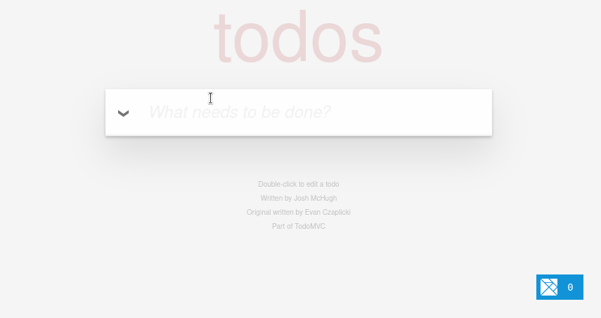

# Elm TodoMVC
This is an example of the TodoMVC project written with the programming language Elm. This example is a clone written by Evan Czaplicki the creator of Elm.

The purpose of TodoMVC application is to demonstrate the structing and organization of JavaScript / frontend frameworks.

This project has been helpful for me and learning Elm as it is a functional programming language with immutability and Modul View Update pattern. The TodoMVC project shows how to add, edit, remove and update items within a list and toggle list item visibility. As I have been learning Elm, these concepts have been some of the more difficult ones to master.

Demonstration GIF


This application runs with NPM and Vite.

Install dependencies:
```shell
npm install
```

Run the application:
```shell
npm run dev
```
